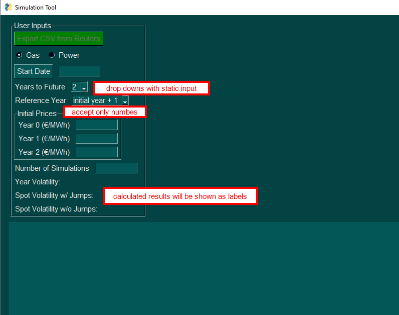
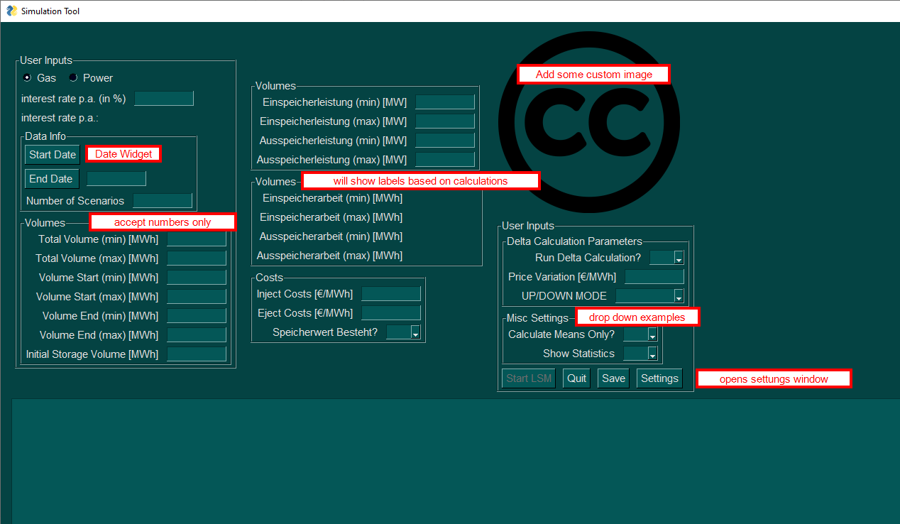

# PySimpleGui Project

With [PySimpleGui](https://pysimplegui.readthedocs.io/en/latest/) I was able to easily create a small user interface 
to operate some complex simulations. Here I would like to share the code I used to create the GUI in hope to help 
someone struggling with their UI. It's not a beauty, but it fulfills its duty.

## Simple Example

## Complex Example

